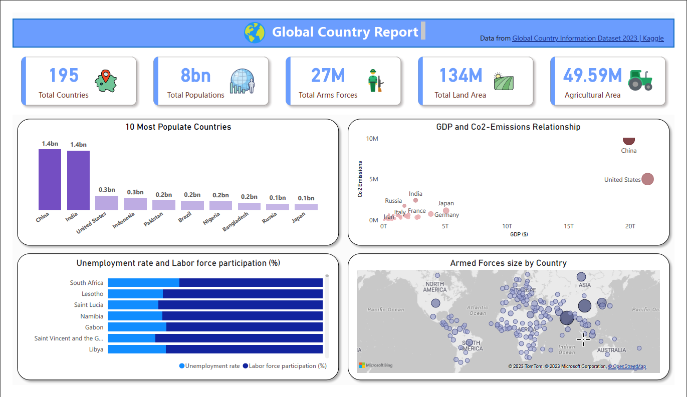
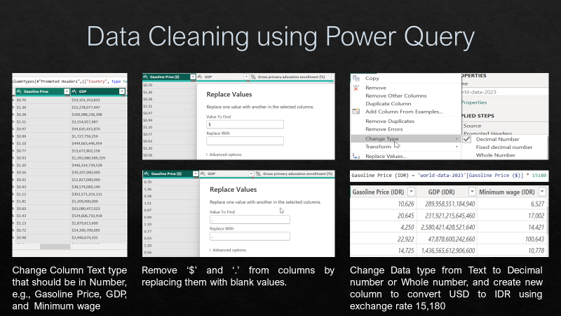
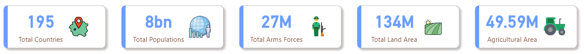
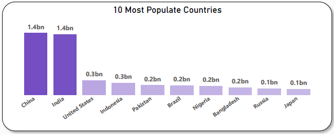
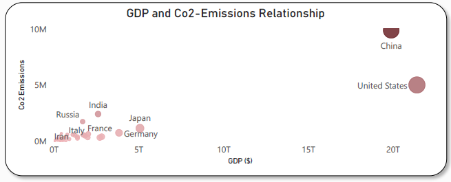
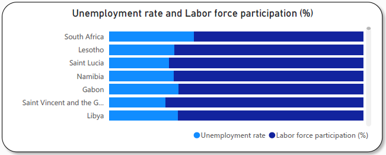
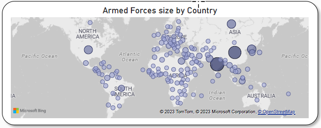

# Final Visualization with Power BI

## About Project

In-depth analysis and cross-country comparisons all countries worldwide, encompasses demographic statistics, economic indicators, environmental factors, healthcare metrics, education statistics, and much more.

Data used from [Global Country Report 2023](https://www.kaggle.com/datasets/nelgiriyewithana/countries-of-the-world-2023?datasetId=3495122&sortBy=voteCount)

## Problem Statements

1. Cards Header
2. Most Populate Countries in the World.
3. Investigate the relationship between healthcare and economy aspects. 
4. Labor Force and Unemployment Analysis.
5. Geographical Distribution of Arms Force.

## Data Cleaning

Cleaning and Changing Data Type to appropriate Data Types.

## Cases

1. Cards Header.
   

   * Dataset has 195 total countries
   * More than 8 billion populations
   * About 27 million arms force size
   * About 134 million km2 of land area
   * About 50 million km2 of agricultural area

2. 10 Most Populate Countries in the World.
   

   * China and India are the 2 most populate countries with aver 2.8 billion population shared
   * Difference of population size from both of above countries (China & India) to the next country (USA) is almost 5 times
   * Most populated continent is Asia where China, India, Indonesia, Pakistan, Bangladesh and Japan reside (6 countries from 10 top most populated countries)

3. Investigate the relationship between healthcare and economy aspects.
   

   * GDP and Co2-emissions are having correlation where countries with the most GPD (China, USA) are having largest Co2-emissions, it maybe from industrialized.

4. Labor Force and Unemployment Analysis.
   

   * Unemployment rate in Africa is higher than other continent
   * Countries with largest minimum wage tend to have low unemployment rate

5. Geographical Distribution of Arms Force.
   

   * Asia is continent with the largest arms force size.
   * India, China, Russia, USA, and Nort Korea are the countries with the largest arms force size.
   * In Africa, Egypt is the country with the largest arms force size.